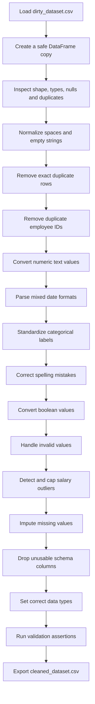

<p align="center">
  
</p>

<p align="center">
  
</p>

<p align="center">
  
  
  
  
</p>

---

# 🧠 Project Overview

**Professional Data Cleaning & Preprocessing** is a complete data-quality project built with Python and Pandas.

The project transforms a deliberately corrupted employee dataset into a clean, consistent, validated, and analysis-ready dataset. It identifies and resolves **15 different categories of data problems**, including missing values, duplicate records, invalid values, inconsistent labels, mixed date formats, outliers, incorrect data types, schema issues, and class imbalance.

The notebook documents every cleaning step with:

- Problem identification
- Before-and-after comparison
- Cleaning logic
- Explanations and comments
- Visualizations
- Validation checks
- Final CSV export

---

# 🎯 Assignment Objective

The main objective is to clean `dirty_dataset.csv` and generate:

```text
cleaned_dataset.csv
```

The final dataset must be:

- Free from missing values
- Free from exact duplicate rows
- Free from duplicate employee IDs
- Consistent in labels and spelling
- Correctly typed
- Validated against expected ranges
- Ready for analysis or machine-learning preparation

---

# 📊 Dataset Overview

| Property | Value |
|---|---:|
| Dataset | `dirty_dataset.csv` |
| Original rows | 20,300 |
| Original columns | 15 |
| Final rows | 19,801 |
| Final columns | 14 |
| Exact duplicate rows found | 300 |
| Duplicate employee IDs found | 499 |
| Target majority class | Approximately 95% |
| Target minority class | Approximately 5% |
| Language | Python 3.x |
| Environment | Jupyter Notebook / Google Colab |

---

# 🧾 Dataset Columns

| Column | Expected Type | Main Data Problems |
|---|---|---|
| `employee_id` | Integer | Duplicate identifiers |
| `name` | String | Clean reference column |
| `age` | Integer | Missing and invalid values |
| `salary` | Float | Missing values, symbols, negatives, outliers |
| `join_date` | Date | Missing values and mixed formats |
| `department` | String | Missing, inconsistent, misspelled labels |
| `gender` | String | Missing, empty, inconsistent labels |
| `country` | String | Missing and inconsistent labels |
| `city` | String | Missing values and spelling mistakes |
| `weight_kg` | Float | Missing values and `kg` suffix |
| `is_active` | Boolean | Mixed boolean and string values |
| `review` | String | Missing and noisy text |
| `price` | Float | Missing, negative, and currency-formatted values |
| `weight_kg_duplicate` | Empty | Entire column is null |
| `target` | Integer | Severe class imbalance |

---

# ⚡ Data Quality Problems Solved

| No. | Problem | Cleaning Strategy |
|---:|---|---|
| 01 | Missing values | Median, mode, fallback values, and median date |
| 02 | Exact duplicate rows | Removed with `drop_duplicates()` |
| 03 | Duplicate employee IDs | Kept first unique employee record |
| 04 | Mixed date formats | Parsed using explicit date formats |
| 05 | Numeric data stored as text | Removed `$`, commas, and `kg` |
| 06 | Inconsistent labels | Standardized with mapping dictionaries |
| 07 | Spelling mistakes | Corrected city and department names |
| 08 | Salary outliers | Detected and capped using the IQR method |
| 09 | Invalid values | Converted to missing and imputed safely |
| 10 | Noisy review text | Replaced meaningless text with `No Review` |
| 11 | Boolean strings | Converted `True`, `False`, `1`, and `0` |
| 12 | Incorrect data types | Cast to integer, float, datetime, and boolean |
| 13 | Range violations | Validated age, price, and salary boundaries |
| 14 | Class imbalance | Analyzed and demonstrated random oversampling |
| 15 | Schema issue | Removed the entirely null duplicate column |

---

# 🧭 Cleaning Pipeline



---

# 🏗 Technology Stack

### Programming Language

- Python 3.x

### Data Processing

- Pandas
- NumPy

### Visualization

- Matplotlib
- Seaborn

### Imbalanced Data Handling

- imbalanced-learn
- scikit-learn

### Development Environment

- Google Colab
- Jupyter Notebook
- JupyterLab

### Version Control

- Git
- GitHub

---

# 🔍 Key Cleaning Decisions

## Missing Numeric Values

Numeric columns are filled using the **median** because it is more resistant to extreme values than the mean.

```python
df_clean[column] = df_clean[column].fillna(
    df_clean[column].median()
)
```

## Missing Categorical Values

Categorical columns are filled using the most frequently occurring value.

```python
df_clean[column] = df_clean[column].fillna(
    df_clean[column].mode()[0]
)
```

## Duplicate IDs

The first record for each employee ID is preserved.

```python
df_clean = df_clean.drop_duplicates(
    subset=["employee_id"],
    keep="first"
)
```

## Salary Outliers

Salary outliers are identified using the Interquartile Range:

```text
IQR = Q3 - Q1
Lower Bound = Q1 - 1.5 × IQR
Upper Bound = Q3 + 1.5 × IQR
```

Extreme salary values are capped using the calculated boundaries.

## Class Imbalance

The original class distribution is preserved in the exported clean dataset.

Random oversampling is demonstrated separately for machine-learning preparation. In a real ML workflow, oversampling should only be applied to the training set after the train-test split.

---

# 📈 Before and After Results

| Data Quality Check | Before Cleaning | After Cleaning |
|---|---:|---:|
| Rows | 20,300 | 19,801 |
| Columns | 15 | 14 |
| Exact duplicate rows | 300 | 0 |
| Duplicate employee IDs | 499 | 0 |
| Missing values | Present | 0 |
| Invalid ages | Present | 0 |
| Negative prices | Present | 0 |
| Extreme salary values | Present | Capped |
| Mixed date formats | Present | Standardized |
| All-null columns | 1 | 0 |

---

# ✅ Final Validation

The notebook uses assertions to verify the final dataset.

```python
assert df_clean.isnull().sum().sum() == 0
assert df_clean.duplicated().sum() == 0
assert df_clean["employee_id"].duplicated().sum() == 0
assert df_clean["age"].between(18, 65).all()
assert df_clean["salary"].between(15000, 500000).all()
assert (df_clean["price"] > 0).all()
assert "weight_kg_duplicate" not in df_clean.columns
```

Expected final result:

```text
All validation tests passed successfully.

Final shape: (19801, 14)
Missing values: 0
Exact duplicates: 0
Duplicate employee IDs: 0
```

---

# 🎯 Target Class Distribution

The cleaned dataset preserves the original target distribution:

| Target Class | Records | Approximate Percentage |
|---:|---:|---:|
| `0` | 18,814 | 95.02% |
| `1` | 987 | 4.98% |

This imbalance is analyzed visually and can be handled during model training with:

- Random oversampling
- Class weights
- SMOTE after suitable feature encoding
- Stratified train-test splitting

---

# 📂 Project Structure

```text
data-cleaning-assignment/
│
├── README.md
├── data_cleaning.ipynb
├── dirty_dataset.csv
├── cleaned_dataset.csv
└── requirements.txt
```

### File Descriptions

| File | Description |
|---|---|
| `README.md` | Complete project documentation |
| `data_cleaning.ipynb` | All cleaning steps, explanations, plots, and validation |
| `dirty_dataset.csv` | Original unclean dataset |
| `cleaned_dataset.csv` | Final validated dataset |
| `requirements.txt` | Required Python libraries |

---

# ⚙️ Installation

## Clone the Repository

```bash
git clone https://github.com/miniSOWAD/YOUR_REPOSITORY_NAME.git
cd YOUR_REPOSITORY_NAME
```

## Create a Virtual Environment

### Windows

```bash
python -m venv venv
venv\Scripts\activate
```

### Linux or macOS

```bash
python3 -m venv venv
source venv/bin/activate
```

## Install Dependencies

```bash
pip install -r requirements.txt
```

## Start JupyterLab

```bash
jupyter lab
```

Open `data_cleaning.ipynb` and run all cells from top to bottom.

---

# ☁️ Run in Google Colab

1. Open Google Colab.
2. Upload or open `data_cleaning.ipynb`.
3. Place `dirty_dataset.csv` inside:

```text
/content/sample_data/dirty_dataset.csv
```

4. Run every cell in order.
5. The notebook will create:

```text
/content/cleaned_dataset.csv
```

6. Download the final dataset using:

```python
from google.colab import files

files.download("/content/cleaned_dataset.csv")
```

---

# 📦 Requirements

The `requirements.txt` file contains:

```text
pandas
numpy
matplotlib
seaborn
imbalanced-learn
scikit-learn
jupyterlab
```

Install all packages with:

```bash
pip install -r requirements.txt
```

---

# 📊 Recommended Visualizations

The notebook should include:

- Missing-value heatmap
- Salary boxplot before cleaning
- Salary boxplot after outlier treatment
- Target class distribution bar chart
- Before-and-after data-quality summary

These visualizations make the cleaning decisions easier to understand and strengthen the assignment documentation.

---

# 🧪 Reproducibility

Before submitting the project:

1. Restart the notebook runtime.
2. Run all cells from the beginning.
3. Confirm that no cell produces an error.
4. Verify that `cleaned_dataset.csv` is generated.
5. Confirm that all validation assertions pass.
6. Push the final files to GitHub.

In Jupyter:

```text
Kernel → Restart Kernel and Run All Cells
```

In Google Colab:

```text
Runtime → Restart session and run all
```

---

# 🚀 GitHub Submission

```bash
git init
git add .
git commit -m "Add complete data cleaning assignment"
git branch -M main
git remote add origin https://github.com/miniSOWAD/YOUR_REPOSITORY_NAME.git
git push -u origin main
```

Recommended commit messages:

```text
docs: add dataset exploration
fix: remove duplicate rows and employee IDs
fix: normalize numeric and date columns
fix: standardize categorical labels
fix: handle invalid values and salary outliers
feat: add class imbalance analysis
docs: add final validation and project README
```

---

# 🌍 Future Improvements

- Build an automated reusable cleaning pipeline
- Add unit tests for every validation rule
- Add a data-quality report with percentages
- Add interactive visualizations
- Build a Streamlit interface for CSV upload and cleaning
- Add automatic schema detection
- Add configurable outlier-handling strategies
- Integrate experiment tracking for ML preprocessing

---

# 👨‍💻 Author

**Md Mahruf Alam**

Software Engineer  
Data Analysis Enthusiast  
Problem Solver  

GitHub: [@miniSOWAD](https://github.com/miniSOWAD)

---

<p align="center">
  <b>⭐ If this project helped you, consider giving the repository a star!</b>
</p>
